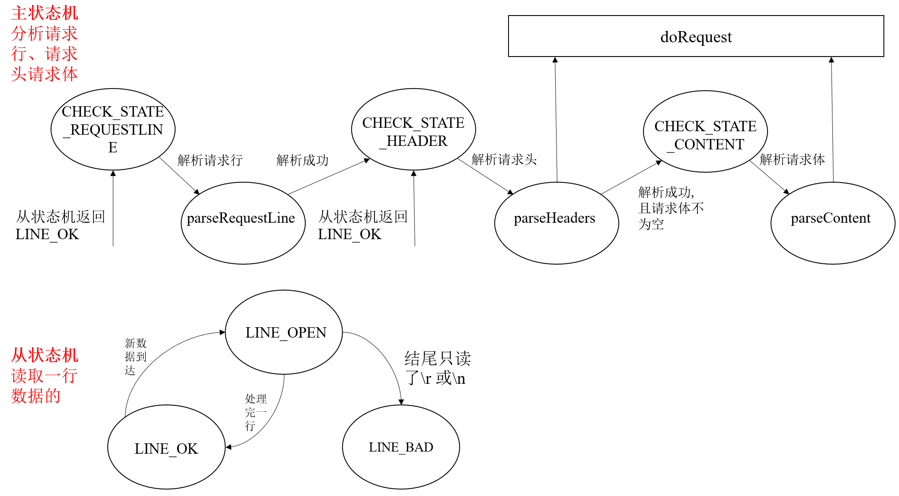

# WebServer
这是个人学习webserver的一个项目；
## 目前已经完成的工作：
- 创建线程池
- 利用epoll边沿触发的IO复用技术监听事件
- 使用reactor模式
- 采用状态机解析http get
- 加入时间堆管理连接
- 加入webbench进行压力测试(本地已完成，远程未实现)

## 后序准备实现的工作：
- 加入日志系统
- 实现http post
- 提供注册与登录功能，与mysql数据库连接
- 引入协程，提高性能 

## 工作记录
- 修复ET触发却没有循环读取导致服务器卡死的问题；
- 将server独立写成一个类，从main中分离出来；
- 加入了基于小根堆的定时器容器，采用单例模式来实现；
- 将read()与write()从主线程中放入处理线程中，从reactor模拟的Proactor模式修改为reactor模式；目的是不让主线程的工作量太大。
- 在server中使用时间堆管理超时连接,对于定时器采用延时销毁的策略，即任务执行结束时，仅仅断开定时器与套接字的联系，并不真正销毁定时器；由心跳函数来清除定时器；同样增加定时器的expire时，也是新建一个定时器然后断开原来定时器的联系;采用延时销毁的策略原因是如果原地修改定时器的话，需要查询定时器在堆数组中的位置，这样代价比较大。

## 补充
- GET请求分析时状态转移图

